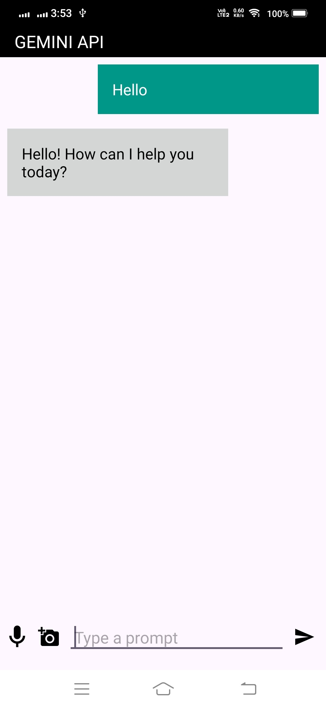
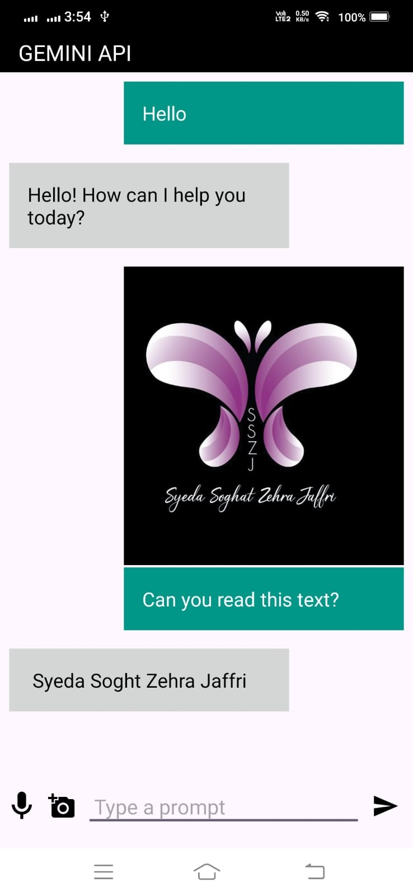
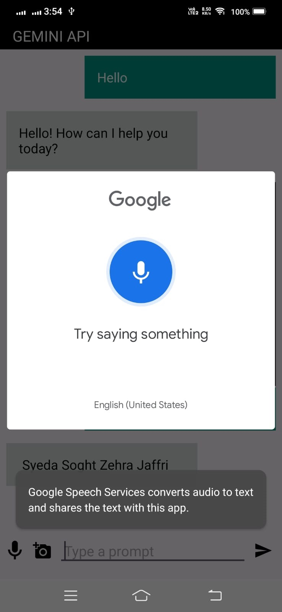

# Gemini API Chatbot

Gemini API Chatbot is an Android application that demonstrates chat functionality with image attachment and voice input capabilities. It uses MVVM architecture with Kotlin coroutines for asynchronous programming. This chatbot application enables users to send text messages, attach images, and use voice input to interact with the chat.

## Features

- **Send Text Messages:** Users can type and send text messages to the chatbot.
- **Attach Images:** Users can attach images from their gallery to their messages.
- **Voice Input:** Users can use voice input to send messages, utilizing the device's speech recognition capabilities.
- **View Chat History:** The application displays the chat history in a RecyclerView, allowing users to scroll through previous messages.
- **Display Selected Image:** Users can see a preview of the selected image before sending it.

## Screenshots

Add screenshots of your application to the `screenshots` directory within your project. You can reference these screenshots in your README file using the following markdown syntax:








## Installation

1. Clone the repository:

   ```bash
   git clone https://github.com/sszjcapricorn22/Gemini-API-.git
